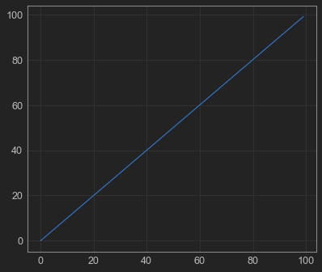
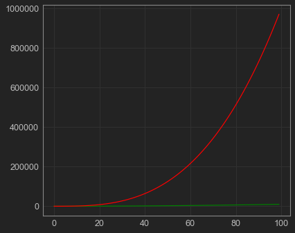
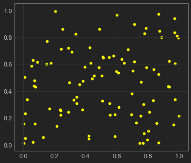
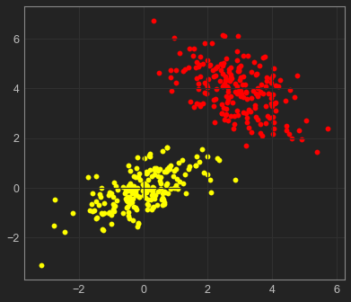

# About Me
<br>

### Prateek Narang
- Computer Science Graduate from _Delhi Technological University(DTU)_
- Coder with passion for teaching
- Presently **Founding Member at Coding Blocks**
- Areas of Interest - Algorithms, Competitive Coding, Machine Learning and Game Development.
- Worked with **SanDisk** in the past
- Won Couple of Hackathons & Competitions like Code For India, Smart India Hackathon etc
- Been to ACM-ICPC Chennai Regionals.
- Interactive CV - _www.prateeknarang.com_ is hugely popular among students, it has been viewed in over 120 countries


# Machine Learning LIVE Webinar

## Today's topics

- Intro to Machine Learning
    - What is Machine Learning/ Machine Intelligence ?
    - Few interesting Applications of Machine Learning
    - Supervised,Unsupervised Learning and Reinforcement Learning
    <br><br>
- Hands on Session
    - Some Python Basics
    - Working with Numpy & Pandas
    - Steps involved in Machine Learning
    - Building your first Machine Learning Algorithm
    - K-Nearest Neighbours
    - Working with Datasets(MNIST Dataset)
    - LIVE Project 

# Machine Intelligence 
Machine learning is a subfield of artificial intelligence (AI) concerned with algorithms that allow computers to learn. What this means, in most cases, is that an algorithm is given a set of data and infers information about the properties of the data—and that information allows it to make predictions about other data that it might see in the future. In simple terms, it gives  **preditive power** to computers !

# Machine Learning vs Artificial Intelligence
- Aritificial Intelligence is a system which interacts with surroundings
- AI systems have sensors to collect data from surroundings
- Machine Learning can be considered as the **"brain of AI"** which process the input data
- ML algorithm frames an appropriate answer, and which is sent back back to the surroundings.

### Example of Self-Driving Car
- Input data - Set of images caputured by the sensor

- Processing by Machine Learning Algorithm - A model trained on images processes it, looks for any obstacles 

- Output is a required 'float' value as the output, giving the required acceleration of the car.


# Why the Hype ?
 - Every minute up to 300 hours of video are uploaded to YouTube.

 - Average of 31.25 million messages and view 2.77 million videos every minute on Facebook.
 -  More data has been created in the past two years than in the entire previous history of the human race.
 - At the moment less than 0.5% of all data is ever analyzed and used, just imagine the potential here
    
# Machine Learning In Industry
### Google Page Ranking
### Google - Natural Language Search Queries
### Netflix Suggestions.
### Tinder, for you to “chill”
### Tesla Self Driving Cars 
### Political Campaigns (Sentiments of People)
### Spam Filtering
### Google AdSense ( Ads based upon your history)
### Bio-informatics ( Predicting Cancers, IBM Watson )
### Apple Siri - Speech Recognition and Talking
### Chatbots like Tay, Ruuh

# Machine Learning at Home

### Google “Allo”
### Snapchat Filters
### Google Home and Amazon “Alexa”
### Facebook Photo Tagging
### PRISMA
### Recommendations on Amazon, Flipkart
### and many more...


# Few Interesting Applications 
Some of these are covered as class Projects in Coding Blocks - Perceptron Machine Learning Course.

# Neural Art - PRISMA


<br><br><br><br>

# Conversational Engine(Microsoft Ruuh)
<br> <br>


<br><br><br><br>

# Tay Tweets(Tweet Bot - Microsoft)


<br><br><br><br>

# Playing with Words and Images (Vector Arithmetic)


<br><br><br><br>

# Colorizing the World using Neural Nets


<br><br><br><br>

# Story Generation


<br><br><br><br>


# Story of Alpha-Go Vs Lee Sedol


<br><br><br><br>

# AI in Games


<br><br><br><br>

# And many more ...

# Different Machine Learning Approaches
## Supervised Learning
- Algorithms to get a set of *Labeled Data* called Training Data
- Predictions are made on a set of *Unlabled Data* called Testing Data
- Example - Spam Filtering in emails, Obstacle Detection in Images, Classifying Fruits

- Algorithm is trained using a model, which is based on various parameters called features.

| Color(X)      | Sweetness(Y)    | Label  |
| ------------- |-------------:| -----:|
| 0.80       | 0.90          |   Apple |
| 0.80       | 0.84          |   Apple |
| 0.10       | 0.27          |   Lemon |
| 0.30       | 0.47          |   Lemon |
| 0.83       | 0.83          |   Apple |
| 0.60       | 0.97          |   Apple |

## Unsupervised Learning
- Algorithm don't get set of labeled data
- Algorithm automatically extracts hidden patterns from the data.
- Mostly used to classify data into various sets, similar data is clubbed into a single set called a cluster. 
- Example: Clustering Algorithms to classify a set of related data into a single cluster
<br><br>

| Color(X)      | Sweetness(Y)    
| ------------- |-------------:|
| 0.80       | 0.87          |  
| 0.80       | 0.83          |  
| 0.10       | 0.27          |  
| 0.30       | 0.47          |  
| 0.83       | 0.82          |  
| 0.60       | 0.97          |  
## Reinforcement Learning
- It has a feedback element to improve its performance
- Based upon the idea of "reward", algorithm will move in a direction to achieve maximum reward.
- Good Application : Teaching Machine to play games like Tic-Tac-Toe,Chess etc
- Algorithms uses moves tried in the past which led to successful results

# Popular Techniques
- K-Means
- K-Nearest Neighbours
- Regression
- Decision Trees
- Naive Bayes
- Neural Networks
- Support Vector Machines
- Neural Nets
- Deep Learning
- Support Vector Machines(SVM)

# Open Source Packages
- Scikit - Learn
- TensorFlow
- Pytorch


# Developer Checklist
- Basic Python 2.7+ ,Pip, Jupyter-Notebook installed
- Numpy - Mathematic Operations
- Pandas - Working with CSV's(Excel Sheets), Data reading and writing
- Matplotlib - Plotting Graphs
# Python Basics
- Lists
- Dictionaries
- Sorting
- Lambda Function
- Range Function


```python
# Working with Lists
a = [ 1,2,4,5,6,"Hello"]

print a

# Slicing in Lists
print a[1:2]
print a[2:]
print a[:4]
print a[:]

# Dictionaries in Python ( Hashmaps in C++, JSON in javascript)
prices = {
    "mango":100,
    "apple":120,
    "banana":[10,20,30]
}

print type(prices)

print prices["mango"]

#Iterate over all the keys
print prices.keys()
print prices.values()

# Loops
i = 1
while i<=10:
    print i
    i += 1
    
# Range Fn (s,e,jump)
range(1,10,2)

x = "Python"
if x=="Python":
    print "yes"
else:
    print "no"

```

    [1, 2, 4, 5, 6, 'Hello']
    [2]
    [4, 5, 6, 'Hello']
    [1, 2, 4, 5]
    [1, 2, 4, 5, 6, 'Hello']
    <type 'dict'>
    100
    ['mango', 'apple', 'banana']
    [100, 120, [10, 20, 30]]
    1
    2
    3
    4
    5
    6
    7
    8
    9
    10
    yes
    


```python
# Sorting in Lists
a = [5,4,3,1,2]

a = sorted(a,reverse=True)
print a
```

    [5, 4, 3, 2, 1]
    

# Math in Python | Packages & Imports


```python
import math

print math.log10(100)
print math.sqrt(2)
```

    2.0
    1.41421356237
    


```python
from math import sqrt as sq

sq(100)
```


    10.0


# Scientific Computation 


```python
import numpy as np
from matplotlib import pyplot as plt
%matplotlib inline
```


```python
# Numpy which is library acutally written in C and Python Interface
# Arrays in Numpy

arr = np.array([1,2,3,4])
# it is of fixed size, it is not dynanimc 
print type(arr)
```

    <type 'numpy.ndarray'>
    


```python
# 2-D arrays in Numpy

a = np.zeros((4,4))
print a

a[ : ,0] = 2
a[1, :] = 3
print a
```

    [[ 0.  0.  0.  0.]
     [ 0.  0.  0.  0.]
     [ 0.  0.  0.  0.]
     [ 0.  0.  0.  0.]]
    [[ 2.  0.  0.  0.]
     [ 3.  3.  3.  3.]
     [ 2.  0.  0.  0.]
     [ 2.  0.  0.  0.]]
    


```python
# Unique and Argmax Functions
arr = np.asarray([1,2,3,5,3,7,4,2,1,7,7])

b = np.unique(arr,return_counts=True)
print b
index = b[1].argmax()
print b[0][index]
```

    (array([1, 2, 3, 4, 5, 7]), array([2, 2, 2, 1, 1, 3]))
    7
    

# Plotting Graphs using Matplot Lib


```python
from jupyterthemes import jtplot
jtplot.style()

a = np.asarray(range(100))

plt.figure(0)
plt.plot(a)

plt.figure(1)
plt.plot(a**2,color='green')
plt.plot(a**3,color='red')

plt.show()
```








```python
# Scatter Plots

# Random Values in the Range 0 and 1
arr = np.random.random((100,2)) 
print arr.shape

print arr 
plt.figure(0)
# First Paramenter ix X Coordinate, Second Paratmeter is Y
plt.scatter(arr[:,0],arr[:,1],color='yellow')
plt.show
# We are using the Scatter Plot
```

    (100, 2)
    [[ 0.00291436  0.01448286]
     [ 0.51031075  0.65767026]
     [ 0.97074722  0.83606565]
     [ 0.86743705  0.01732897]
     [ 0.88593955  0.8020919 ]
     [ 0.28751527  0.7223667 ]
     [ 0.02263074  0.3382036 ]
     [ 0.69338037  0.22768306]
     [ 0.77667507  0.82879251]
     [ 0.61327601  0.28087191]
     [ 0.31060801  0.69091621]
     [ 0.28837317  0.24580994]
     [ 0.06039161  0.02097023]
     [ 0.7737081   0.0862868 ]
     [ 0.21237252  0.13823183]
     [ 0.48561855  0.57743034]
     [ 0.86938209  0.97227449]
     [ 0.06277177  0.63193716]
     [ 0.34021614  0.35706364]
     [ 0.39370643  0.5804014 ]
     [ 0.41925511  0.04778853]
     [ 0.50533611  0.32895564]
     [ 0.80257028  0.10471664]
     [ 0.71289916  0.89630801]
     [ 0.45396971  0.51404844]
     [ 0.20334233  0.99497241]
     [ 0.99839354  0.21437453]
     [ 0.55529647  0.22472561]
     [ 0.9728573   0.60438948]
     [ 0.32445404  0.33398996]
     [ 0.55213098  0.31026391]
     [ 0.35979964  0.44872302]
     [ 0.05225356  0.58651425]
     [ 0.6458056   0.60890034]
     [ 0.79562724  0.03879441]
     [ 0.6959736   0.38233052]
     [ 0.7526301   0.21503284]
     [ 0.34190764  0.31116281]
     [ 0.75554644  0.46958625]
     [ 0.93776575  0.62445155]
     [ 0.51429204  0.64805179]
     [ 0.37936658  0.26266611]
     [ 0.08913006  0.61540506]
     [ 0.58724715  0.06253665]
     [ 0.85576013  0.16285239]
     [ 0.83506768  0.33033296]
     [ 0.24312511  0.71298804]
     [ 0.41878801  0.06937431]
     [ 0.07202771  0.48041518]
     [ 0.14903979  0.60142633]
     [ 0.97025292  0.94248153]
     [ 0.93120412  0.43516918]
     [ 0.57869014  0.66465101]
     [ 0.23430332  0.26433057]
     [ 0.07642415  0.43258007]
     [ 0.01275717  0.04839758]
     [ 0.74708051  0.01431588]
     [ 0.76829324  0.0143131 ]
     [ 0.07333657  0.15874178]
     [ 0.29564716  0.46516782]
     [ 0.12790292  0.05567735]
     [ 0.7126499   0.61885085]
     [ 0.25167061  0.86270017]
     [ 0.99573942  0.79714859]
     [ 0.01198528  0.23383981]
     [ 0.44065774  0.49272317]
     [ 0.15193365  0.77113256]
     [ 0.78719606  0.86875411]
     [ 0.23941396  0.25477639]
     [ 0.38347683  0.47451819]
     [ 0.67296508  0.71186838]
     [ 0.86829012  0.52463931]
     [ 0.70273571  0.55131349]
     [ 0.83767118  0.56091251]
     [ 0.79026539  0.5755953 ]
     [ 0.80825375  0.24356713]
     [ 0.42424922  0.72464852]
     [ 0.58704666  0.2260189 ]
     [ 0.59772621  0.54736828]
     [ 0.33457846  0.82713099]
     [ 0.98668045  0.81246355]
     [ 0.23846308  0.22472451]
     [ 0.00846766  0.50492411]
     [ 0.17579599  0.61034498]
     [ 0.63107979  0.63797212]
     [ 0.77107512  0.30251411]
     [ 0.87480609  0.84771177]
     [ 0.97447     0.33918272]
     [ 0.48713053  0.86355211]
     [ 0.59996644  0.96567419]
     [ 0.16768305  0.27008325]
     [ 0.00260076  0.15940528]
     [ 0.61041731  0.53609626]
     [ 0.54895212  0.65345545]
     [ 0.43086309  0.60843941]
     [ 0.93793111  0.43365899]
     [ 0.72604315  0.16615365]
     [ 0.06820395  0.44045418]
     [ 0.50274979  0.51384979]
     [ 0.96437541  0.14919605]]
    


    <function matplotlib.pyplot.show>





# Probability Distribution 
## Random Variable
 Random variable is a variable whose possible values are numerical outcomes of a random experiment.
 
 For eg - 
 1) A random variable could denote number of characters in all the books in the world
 2) Length of movie names in all the movies released so far
 3) Outcomes of dice throw experiment
 

### Mean and Expectation
    u  = E(X)
    u is the mean
    E(X) is the expected value of X.

## Normal/Gaussian Distribution

Normal distributions are important in statistics and are often used in the natural and social sciences to represent real-valued random variables whose distributions are not known.

## Standard Normal Distribution


## Multivariate Normal Distribution
Example in 2 dimensions-


# KNN Algorithm

- The K-nearest-neighbor (KNN) algorithm measures the distance between a query scenario and a set of scenarios in the data set.
- KNN falls in the supervised learning family of algorithms. Informally, this means that we are given a labelled dataset consisting of training observations (x,y) and would like to capture the relationship between x and y. 
- This method used for classification and regression.

<br>
<br>

Training Data
<br>

| Color(X)      | Sweetness(Y)    | Label  |
| ------------- |-------------:| -----:|
| 0.80       | 0.83          |   Apple |
| 0.80       | 0.85          |   Apple |
| 0.10       | 0.27          |   Lemon |
| 0.30       | 0.47          |   Lemon |
| 0.83       | 0.87          |   Apple |
| 0.60       | 0.97          |   Apple |


Test Data 
<br>

| Color(X)      | Sweetness(Y)    | Actual Label  | Predicted Label
| ------------- |-------------:| -----:|-----:|
| 0.91       | 0.75          |   Apple | Apple 
| 0.11       | 0.25          |   Lemon | Lemon

# Code


```python

mean_01 = np.array([3.0,4.0])

#Lemons are sour, avg sweetness will low, they have some low value for color
# Red values is higher, Yellow Lower
# Sweetness is higher, Sourness Lower
mean_01 = np.array([3.0,4.0])

#2 X 2 identity matrix
cov_01 = np.array([[1.0,-0.5],[-0.5,1.0]])

mean_02 = np.array([0.0,0.0])

cov_02 = np.array([[1.0,.5],[0.5,0.6]])

dist_01 = np.random.multivariate_normal(mean_01,cov_01,200)
dist_02 = np.random.multivariate_normal(mean_02,cov_02,200)

print dist_01.shape
print dist_02.shape
# print dist_01
```

    (200, 2)
    (200, 2)
    


```python
# Try to make a scatter plot of these points
plt.figure(0)

for x in range(dist_01.shape[0]):
    plt.scatter(dist_01[x,0],dist_01[x,1],color='red')
    plt.scatter(dist_02[x,0],dist_02[x,1],color='yellow')
   
plt.show()
```





```python
# Training Data Preparation

# 400 Samples - 200 Apples, 200 for Lemons

labels = np.zeros((400,1))
labels[200:] = 1.0

X_data = np.zeros((400,2))
X_data[:200,:] = dist_01
X_data[200: ,:] = dist_02

# print X_data
# print labels
```

# KNN  Algorithm :)


```python
#Dist of the query_point to all other points in the space ( O(N)) time for every point + sorting 
# You can the complexity O(Q.N)

#Euclidean Distance 
def dist(x1,x2):
    return np.sqrt(((x1-x2)**2).sum())

x1 = np.array([0.0,0.0])
x2 = np.array([1.0,1.0])

print dist(x1,x2)

```

    1.41421356237
    


```python
def knn(X_train,query_point,y_train,k=5):
    vals = []
    
    for ix in range(X_train.shape[0]):
        v = [ dist(query_point,X_train[ix,:]), y_train[ix]]
        vals.append(v)
    # vals is a list containing distances and their labels
    updated_vals = sorted(vals)
    # Lets us pick up top K values
    pred_arr = np.asarray(updated_vals[:k])
    pred_arr = np.unique(pred_arr[:,1],return_counts = True)
    #Largest Occurence 
    index = pred_arr[1].argmax() #Index of largest freq  
    return pred_arr[0][index]

q = np.array([0.0,4.0])

predicted_label  = knn(X_data,q,labels)
print predicted_label

## Run a Loop over a testing data(Split the original data into 2 sets - Training, Testing)

# FInd predictions for Q Query points

# If predicted outcome = actual outcome -> Sucess else Failure

# Accuracy =  (Successes)/ (Total no of testing points) * 100
```

    0.0
    
