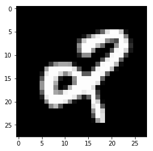
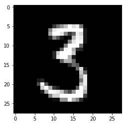

```python
import numpy as np
import pandas as pd
from matplotlib import pyplot as plt
%matplotlib inline
```


```python
ds = pd.read_csv('./train.csv')
print ds.shape

data = ds.values
print data.shape
```

    (42000, 785)
    (42000, 785)
    


```python
y_train = data[:, 0]
X_train = data[:, 1:]

# X_train = (X_train - X_train.mean(axis=0))/(X_train.std(axis=0) + 1e-03)

print y_train.shape, X_train.shape

plt.figure(0)
idx = 104
print y_train[idx]
plt.imshow(X_train[idx].reshape((28, 28)), cmap='gray')
plt.show()
```

    (42000,) (42000, 784)
    2
    





```python
def dist(x1, x2):
    return np.sqrt(((x1 - x2)**2).sum())


def knn(X_train, x, y_train, k=5):
    vals = []
    
    for ix in range(X_train.shape[0]):
        v = [dist(x, X_train[ix, :]), y_train[ix]]
        vals.append(v)
    
    updated_vals = sorted(vals, key=lambda x: x[0])
    pred_arr = np.asarray(updated_vals[:k])
    pred_arr = np.unique(pred_arr[:, 1], return_counts=True)
    pred = pred_arr[1].argmax()
    # return pred_arr[0][pred]
    return pred_arr, pred_arr[0][pred]
```


```python
idq = int(np.random.random() * X_train.shape[0])
q = X_train[idq]

res = knn(X_train[:10000], q, y_train[:10000], k=7)
print res
print y_train[idq]

plt.figure(0)
plt.imshow(q.reshape((28, 28)), cmap='gray')
plt.show()
```

    ((array([ 3.]), array([7])), 3.0)
    3
    





### Subscribe us on [Youtube](http://cb.lk/yt) for more such tutorials.
